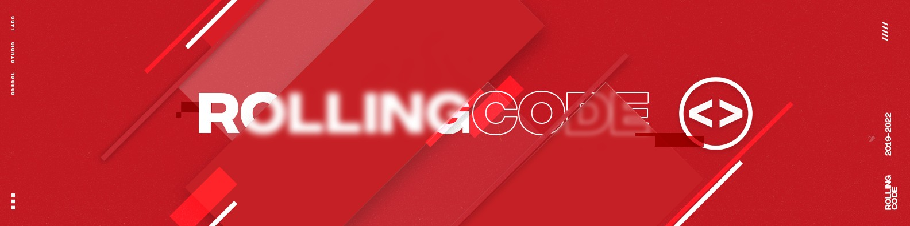

 Este es un Proyecto Grupal De Nuestra Comision 74i De
     
¡Bienvenido al repositorio de proyectos de nuestra comisión! Aquí encontrarás una recopilación de los proyectos en los que estuvimos trabajando, centrándonos en JavaScript y React. Este es un proyecto grupal en el que cada miembro contribuirá con su parte del código, según las tareas asignadas por nuestra mentora "Emilse Arias  " y "Damaris Palacios".

1. Clona este repositorio en tu máquina local:

   git clone https://github.com/rollingcodeschool/proyectosC74i

2 . ¡ No te olvides de Instalar las depencias en tu terminal !
. npm install o npm i

3. Ejucta la Aplicacion:
. npm run dev 

<h3> Autores</h3>

- **Maximiliano Ariel Gomez**:
  - Responsable de la maquetación de la página de Inicio. 

- **Vir Campillo**:
  - Encargada de la revisión del maquetado del compañero Maximiliano Ariel Gomez y del  pull requests.